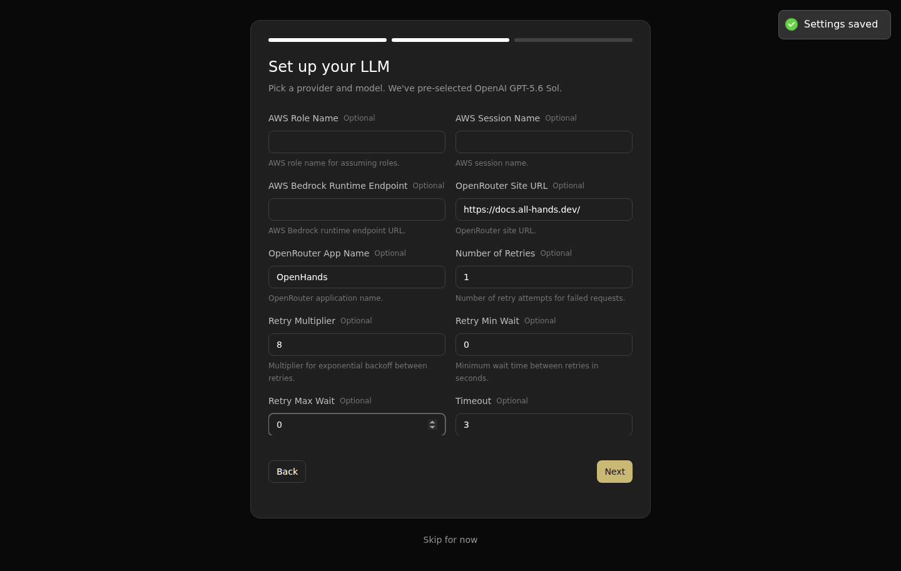

# Live Canvas: onboarding preserves advanced model settings

Before the fix, onboarding displayed timeout **3 seconds** and **1 attempt**, but the new conversation actually received the defaults **300 seconds** and **5 attempts**. After the fix, reopening the saved profile shows **3/1**, and a new agent conversation persists **3/1** and finishes with the disclosed fixture response `EVIDENCE_RECOVERED`.

| Field | Entered in onboarding | Before: actual agent | After: saved profile and agent |
| --- | --- | --- | --- |
| timeout | 3 | 300 | 3 |
| num_retries | 1 | 5 | 1 |
| retry_min_wait | 0 | 8 | 0 |
| retry_max_wait | 0 | 64 | 0 |

[Before UI input](before-entered-options.png), [after saved options](after-saved-options.png), [finished agent](after-finished-agent.png), and [allowlisted persisted configuration](evidence.json). The original before conversation is `2a687d2b-719b-404c-86de-c751db0e3f5e`; the after conversation is `30804b53-8333-43bb-a522-fdb6be0b1bbe`.

The existing production fix reuses the embedded form's `saveControl.getSavePayload()` when creating the active LLM profile. That preserves the canonical fields for both subscription authentication and API-key advanced options. No new serializer or field allowlist was added. The added API-key regression fails on main and passes with this fix; 42 affected tests and focused lint pass. The shared production build passes.

## Reproduce

1. Start an isolated Agent Server with empty persistence and conversations, and serve Canvas pointing its `/api`, `/server_info`, `/health` and `/sockets` routes to that server.
2. In fresh onboarding, select OpenHands. In Advanced, choose `openai/gpt-4o-mini`, a local OpenAI-compatible provider URL, and a dummy API key. In All, enter timeout=3, num_retries=1, retry_min_wait=0 and retry_max_wait=0. Next, then Close.
3. Open Settings → LLM → Profile menu → Edit → All. Read the saved values, then **Cancel**; do not correct or re-save them.
4. Start a new chat asking the disclosed local provider to reply normally without tools. Inspect the actual persisted agent LLM configuration as well as the visible final response.

The real browser, Canvas settings components, Agent Server, SDK, HTTP transport and event persistence execute normally. The [disclosed deterministic provider](https://github.com/OpenHands/software-agent-sdk/blob/07d1911013fedf22a6f3fca4db0a558361a2141c/.pr/stream-timeouts/provider.py.txt) runs locally in `healthy` mode. It needs no real model or GitHub credential. All configuration and conversation creation in the after proof use UI operations; the persistence inspection is read-only.

Before Canvas: `a3c7915db5f47800f5240a25987b2af75b0d8d04`, SDK `c37007429be8b4465a83487dc1fd0914df0ea734`. After Canvas: `9874c820a23e4026483ad9540ec9cb56194ce3ec`, containing production fix `5f259b873e28084b9465587d6eb0f79787ae3f75`; SDK `ac6d12b0b9d76f1cc38a6eb1ea51cd92e34a0bf2`. The integrated after build also contains independent profile-scope and Error-file fixes. The genuine component regression isolates this onboarding fix from those companions.

## Limits and retained failed attempts

The original before discovery came from an exploratory streaming experiment: the UI entered 3/1, but its actual agent used 300/5. That experiment was excluded from the SDK timeout PR's comparison and retained here as evidence of the Canvas payload bug. The later stream run corrected settings through the editor and is a different conversation; it is not this before case.

This report compares persisted onboarding configuration, **not** stream timing: the before provider streamed indefinitely and the after provider replies normally. The before screenshot records entered values; the silently lost values are established by the actual persisted conversation in `evidence.json`. No screenshot of a corrected profile is presented as the original bug. A transient first-run telemetry dialog dismissed before its checkbox operation; retrying onboarding then completed with the same intended values.

This is API-key advanced-options evidence, not a new subscription OAuth login. The existing human-supplied subscription after screenshot in the PR is preserved separately. All private services and completed proof tabs were closed after capture. The GIF uses selected original screenshots, two seconds per frame; playback is condensed. Full scripts and originals remain in `/home/gneubig/work/factory-state/evidence/onboarding-options` and `sdk-stalls/onboarding-after`.
